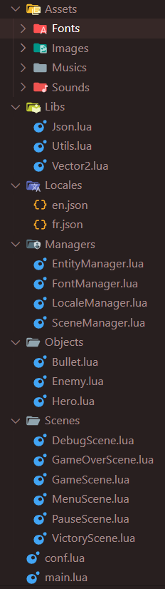

# Documentation technique : Module 1

# 1. Comment jouer ?

## Principe de gameplay

Le but du jeu est de survivre le plus longtemps possible aux ennemis qui apparaissent à l’écran.

Les ennemis apparaissent à un intervalle régulier qui diminue en fonction du score du joueur.

Pour scorer le joueur doit tirer sur les ennemis.

## Commandes de jeu

Le jeu débute sur un menu. Depuis ce menu il est possible de quitter le jeu via touche “Echap”.

La langue du menu peut être modifiée en appuyant sur la touche “L”.

Les commandes de jeu sont visibles sur le menu et sont adaptées aux clavier Azerty et Qwerty.

Pour lancer une partie, il faut appuyer sur la touche “Espace”

Pour jouer, on peut utiliser les touches “ZQSD” en Azerty ou “QASD” en Qwerty ou encore les touches directionnelles.

La cible des tirs se déplace avec la souris et le tir se fait via le clic gauche.

A tout moment du jeu, il est possible de faire pause via la touche “P”.

Pour reprendre le jeu depuis la pause, il suffit d’appuyer sur la touche “P” ou la touche “Espace”

Pour revenir au menu depuis la pause, il faut appuyer sur la touche “Espace”, la partie en cours terminée.

## Comment gagner ?

Il n’y a pas de condition de victoire, le but est de faire le meilleur score.

## Comment perdre ?

Le joueur débute avec 5 cœurs, si un ennemi le touche il perd un demi cœur.

Lors d’une touche, le joueur est invincible pendant 1s afin de s’éloigner de l’ennemi.

S’il ne reste qu’un demi cœur au joueur, celui ci clignote pour interpeler le joueur.

Si le joueur perd tout ses cœurs, l’écran de Game over apparait.

Un appuie sur la touche “Espace” permet de relancer une partie alors qu’un appuie sur la touche “Echap” permet de quitter le jeu. 

# 2. Le code Source

Le code est réalisé en Lua “Objet”.

Le code source est disponible ici : [https://github.com/axork13/ProjetLua](https://github.com/axork13/ProjetLua)

## Structure du projet :

Le code est structuré sous forme de classe objet.



- A la racine du projet se trouve uniquement le fichier de configuration et le main du projet
- Les assets sont placées dans un dossier “Assets”, puis dans un sous dossier correspondant à la ressource associée (fonts, images, etc)
- Le dossier Utils contient les fonctions communes à tout les fichiers (calcul de distance, création de vecteur, etc)
- Le dossier Locales contient les fichiers json permettant une traduction simple des éléments du jeu
- Les Managers sont les éléments qui vont gérer les différents objets du jeu (les entités, les fonts, etc)
- Les objets sont les éléments du jeu (Hero, Enemy, Bullet)
- Les dossier Scenes contient les différentes implémentations des scènes du jeu

Chaque élément de jeu est un objet qui est géré par un EntityManager.

L’EntityManager permet de gérer l’affichage et la mise à jour des éléments du jeu (Hero, Enemy, Bullet). Il permet également de gérer les collisions entre ces éléments.

Le jeu utilise différentes Scenes. Ces Scenes sont gérer via un SceneManager qui permet le chargement ou déchargement de la scène courante à chaque changement de scène.

Il existe également un LocaleManager qui via la librairie json.lua (rxi) permet gérer les langues du jeu via des fichiers json ainsi qu’un FontManager qui permet la gestion de différentes fonts.

La boucle principale du jeu est gérée dans la GameScene.

## Découpage du projet :

Chaque classe est définit de cette manière :

```lua
--<====== exemple de Classe ======>--
local Object = {}

function Object:new()
    local o = {}
    
    setmetatable(o, self)
    self.__index = self

    return o
end

function Object:load()    
end

function Object:unload()
end

function Object:update(dt)
end

function Object:draw()    
end

function Object:keypressed(key)

end

return Object
```

Chaque objet possède ses propres fonctions d’affichage, update, etc.

La fonction new permet de définir la structure de l’objet.

Les fonctions load et unload permettent de charger les éléments graphiques (sprite, etc).

Dans l’EntityManager, la fonction checkCollision permet de parcourir toute les entités du jeu et de vérifier les différentes collisions entre ces entités.

```lua
function EntityManager:checkCollision()
    for i=1, #self.lstEntities do
        if self.lstEntities[i].entityType == "Enemy" then
            local enemy = self.lstEntities[i]
            local enemyBox = {
                x = enemy.pos.x + enemy.width/(enemy.scale*2),
                y = enemy.pos.y-(enemy.scale*2),
                w = enemy.width/(enemy.scale),
                h = enemy.height-(enemy.scale*2)
            }

            for j=1, #self.lstEntities do
                -- Check collision Enemy/Bullet
                if self.lstEntities[j].entityType == "Bullet" then
                    local bullet = self.lstEntities[j]
            
                    local bulletBox = {
                        x = bullet.pos.x - bullet.width / 2, 
                        y = bullet.pos.y - bullet.height/2,
                        w = bullet.width,
                        h = bullet.height
                    }                   

                    if checkAABBCollision(bulletBox.x, bulletBox.y, bulletBox.w, bulletBox.h, enemyBox.x, enemyBox.y, enemyBox.w, enemyBox.h) then
                        bullet.toDelete = true
                        enemy:takeDamage(hero)
                    end
                end

                -- Check collision Enemy/Hero
                if self.lstEntities[j].entityType == "Hero" then
                    local hero = self.lstEntities[j]
            
                    local heroBox = {
                        x = hero.pos.x + hero.width/(hero.scale*2),
                        y = hero.pos.y-(hero.scale*2),
                        w = hero.width/(hero.scale),
                        h = hero.height-(hero.scale*2)
                    }                   

                    if checkAABBCollision(heroBox.x, heroBox.y, heroBox.w, heroBox.h, enemyBox.x, enemyBox.y, enemyBox.w, enemyBox.h) then
                        hero:takeDamage(0.5)
                    end
                end
            end
        end 
    end
end
```

Dans la classe Hero, on calcule l’angle entre le Hero et le curseur de la souris et on calcule la direction correspondante, on change ensuite l’état du Hero en fonction de cette direction.

```lua
    local angle = math.angle(self.pos.x, self.pos.y, mousex, mousey)
    self.mouseDirection = Vector2:new(self.pos.x * math.cos(angle), self.pos.y * math.sin(angle))
    if math.abs(self.mouseDirection.x) > math.abs(self.mouseDirection.y) then
        self.state = self.mouseDirection.x > 0 and "walkright" or "walkleft"
    else
        self.state = self.mouseDirection.y > 0 and "walkdown" or "walkup"
```

## Machine à état :

Il y a plusieurs machine dans mon projet.

La première est la machine à état qui permet la gestion des scènes du jeu :

```lua
sm.lstScene["Debug"] = Debug:new()
sm.lstScene["Menu"] = Menu:new()
sm.lstScene["Game"] = Game:new()
sm.lstScene["Pause"] = Pause:new()
sm.lstScene["GameOver"] = GameOver:new()
sm.lstScene["Victory"] = Victory:new()
```

Les scènes du jeu sont gérés via une liste. La machine à état permet de switcher facilement d’une scène à l’autre via la fonction switchScene du SceneManager

```lua
function SceneManager:switchScene(pSceneType)
    self.currentScene = self.lstScene[pSceneType]    
end
```

La deuxième machine à état est définit pour le Hero

```lua
h.lstSprites["idle"] = {}
h.nFrames["idle"] = 2
h.lstSprites["walkleft"] = {}
h.nFrames["walkleft"] = 6
h.lstSprites["walkright"] = {}
h.nFrames["walkright"] = 6
h.lstSprites["walkup"] = {}
h.nFrames["walkup"] = 6
h.lstSprites["walkdown"] = {}
h.nFrames["walkdown"] = 6
h.lstSprites["attack"] = {}
h.nFrames["attack"] = 2

h.state = "idle"
```

Les états permettent de gérer le sens d’affichage du Hero ainsi que son animation.

Dans mon projet seul les états “walk” et “idle” sont implémentés mais on peut facilement implémenter l’état “attack” pour par exemple gérer une attaque au corps à corps avec une spritesheet et une collideBox spécifique.

.drawio.png)

La dernière machine à état permet de gérer le comportement de l’ennemi.

Chaque ennemi est créé au début à l’état NONE puis il passe à l’état CHANGEDIR qui permet de lui affecter une direction aléatoire.

Une fois qu’une direction lui est appliquée l’ennemi passe à l’état WALK.

Si la vie de l’ennemi est inférieure ou égale à 1, l’ennemi passe à l’état RUNAWAY.

A l’état RUNAWAY,  si le Hero est dans un rayon proche de l’ennemi (valeur detectionRadius), la direction est inversée et la vitesse de l’ennemi est augmenter.

Une fois assez loin du Hero, l’ennemi repasse à l’état WALK.